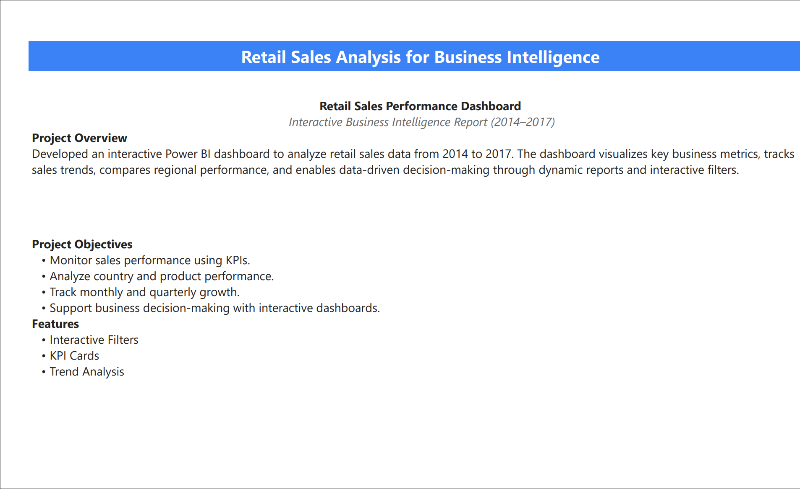

# 📊 Retail Sales Analysis Dashboard (Power BI)

An interactive Power BI dashboard built to analyze retail sales performance from **2014–2017**. The project provides business insights using KPIs, trend analysis, country-wise performance, and product analysis.

---

# Dashboard Preview

---

# Project Overview

This project transforms raw retail sales data into meaningful business insights using Microsoft Power BI. The dashboard enables users to monitor sales performance, analyze profitability, compare regional performance, and make data-driven decisions through interactive visualizations.

---

# Project Objectives

- Analyze Revenue, Cost and Gross Profit
- Compare Country-wise Sales Performance
- Monitor Monthly & Quarterly Growth
- Identify Business Trends
- Support Data-Driven Decision Making

---

# Tools & Technologies

- Microsoft Power BI
- Power Query
- DAX
- Microsoft Excel
- Data Modeling

---

# Dashboard Features

✅ KPI Cards

✅ Interactive Filters

✅ Revenue Analysis

✅ Country-wise Sales

✅ Price Range Analysis

✅ Trend Analysis

---

# Dashboard Screenshots

## Overall Sales Performance

---

## Revenue Analysis

Price Range Analysis.png

---

## Country-wise Sales

Country-wise Sales.png

---

## Price Range Performance

 Price Range Analysis.png

---

# Key Business Insights

- Total Revenue reached **126.01M**
- Gross Profit recorded **86.89M**
- Germany generated the highest sales revenue.
- Medium-value products contributed the highest revenue.
- Interactive dashboards improved sales analysis and reporting.

---

# Skills Demonstrated

- Data Cleaning
- Data Transformation
- Data Modeling
- DAX Measures
- KPI Development
- Dashboard Design
- Business Intelligence
- Data Visualization

---

# Repository Files

| File | Description |
|------|-------------|
| Retail Sales Analysis.pbix | Power BI Dashboard |
| Retail Sales Analysis.xlsx | Dataset |
| Retail Sales Analysis.pdf | Project Report |
| README.md | Project Documentation |

---

# Author

**Kashyap Choudhary**

Aspiring Data Analyst

**Skills:** Excel • SQL • Power BI • DAX • Power Query
